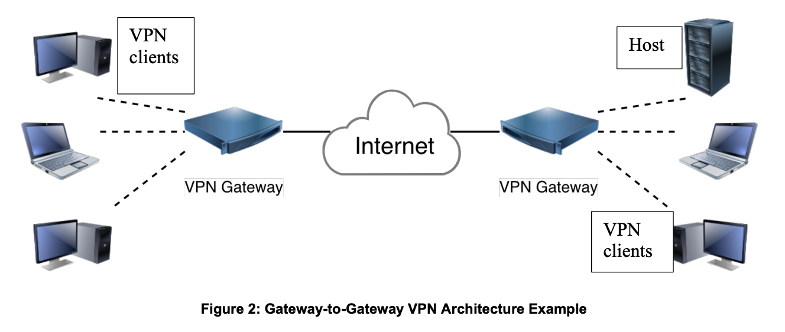

## Features:

  * Confidentiality
  * Encryption
  * Integrity
	* Integrity check by checking message authentication code (MAC)
	* MAC is a checksum based on a mutually agreed secret key
  * Authentication
	* only transmitted to expected endpoint
  * Replay Protection
	* same data will not be accepted multiple times
	* data is not grossly out of order
  * Traffic Analysis Protection
	* protect against person monitoring the network 
	* obfuscate which parties are communicating
	* how often they are communicating
	* how much data is exchanged
	* Traffic flow confidentiality(TFC) capabilities of ESP
		* pad all packets to a single length(usually MTU)
		* send dummy packets to obfuscate the timing of packets
  * Access Control
	* IPsec endpoints perform filtering 
	* ensures only authorized users can access network resources
	* eg) allowing web server access but not file sharing
	* This is aka policy based IPsec
	* In route based IPsec all traffic is accepted at the policy layer
		* 	traffic is filtered by setting routes into IPsec interfaces. 
		* 	routing table acts as a policy filter
	* Policy based IPsec 
	* is more secure than routing based IPsec
	* is not vulnerable to malicious/accidental routing table changes
	* works independently to firewall and other access control mechanism
* Perfect Forward Secrecy (PFS)
	* session keys are changed typically once an hour
	* Old keys are deleted from memory 
		* so that in future nobody can decrypt past messages
	* To make sure old keys has no relationship to new keys we can do a DH exchange again. This mechanism is called PFS
* Mobility
	* outer IP address can change
		* without causing interruption to encrypted flow. 
	* Since application is only concerned about inner IP address,
		* the outer address can change 
		* allows user to change from Wifi to Ethernet without interruption
## VPN
	
* Most common deployment for IPsec
	* built on top of existing physical networks
	* provides secure communication
	* such as internet
	* less expensive than dedicated private links
	* deployments
		* mesh of IPsec connections across all nodes
		* subset of IPsec connections in a network
	* Confidentiality
		* symmetric cryptography
			* less processing power
			* algorithms that implement symmetric encryption -> AES, 3DES
			* modes for symmetric encryption algorithms -> AES-GCM
	* Integrity
		* HMAC
		* AES modes such as AES-CBC, AES-CMAC, AES-GMAC
	* Shared Keys
		* DH key exchange to create a confidential communication channel to compute shared key
		* After DH key exchange peers need to authenticated
	* Peer Authentication
		* uses asymmetric crypto for identity authentication
		* RSA, DSA are commonly used
		* uses private and public key to authenticate peer
			* private key is used to digitally sign the signature
			* public key is used to decrypt the signature and verify the peer
			* keys are aka public/private key pairs
		* PSK
			* pre shared keys
			* less secure
				* prone to dictionary attack
			* each peer must know the key out of band
	* Deployment Risks
		* flaws in an encryption algorithm
		* flaws in software implementing the algorithm
		* encryption key disclosure
			* an attacker who discovers a symmetric key could decrypt previously recorded or current traffic
			* many VPN implementations actually tend to decrease availability 
				* as they add more components, complexity, and services to the existing network infrastructure.
## VPN Deployments
	
* Gateway-to-Gateway
	* aka Site-to-site VPNs
	* 
	* maintained by hardware devices
	* connect multiple users at remote branches to (one or more) central sites.
	* Routing on each network 
		* configured so that hosts on one network communicate with hosts on the other network
		* network traffic is automatically routed through the IPsec connection
		* In tunnel mode
			* the IP address family of the outer ESP packets transmitted between the gateways does not need to be the same as the IP address family of the encrypted IP packets
			* eg) hosts can be IPv6 address but gateway can be IPv4
			* 6in4 or 4in6 to denote the inner and outer IP families
	* only protects data between the two gateways
		* often used when connecting two secured networks
		* eg) branch office to headquarters over the internet
	* transparent to users
		* no VPN client software is installed
	* If connecting two different organizations
		* special DNS configuration might be required
* Remote Access
	* established by software
	* connect mobile users at airports, hotels to a central site 
		* using WLAN hotspots, LAN ports, or modems.	
  * Teleworker VPNs—Tunnels:
	  * maintained by hardware devices
	  * connect (typically) a single user at residence to a central site.

			

  

## References
	- https://www.cisco.com/c/en/us/td/docs/solutions/Enterprise/WAN_and_MAN/QoS_SRND/QoS-SRND-Book/IPSecQoS.html
	- https://nvlpubs.nist.gov/nistpubs/SpecialPublications/NIST.SP.800-77r1.pdf